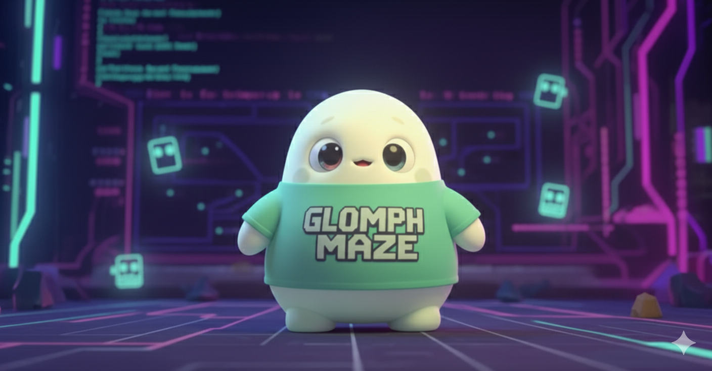

# Glomph Maze



A modern Python rewrite of MyMan, an unofficial text-based clone of the classic Pac-Man game. Terminal-only, no GUI.

## 🐍 Python Rewrite (v0.1.0 - In Progress)

**This branch (`python-rewrite`) contains a complete rewrite in Python 3.11+** with clean, maintainable code.

### Why Python?

- **Maintainable**: ~1,500 lines vs 11,399 lines of C
- **Modern tooling**: Type checking, testing, formatting built-in
- **Clean architecture**: Natural separation of concerns
- **Same assets**: All 655 mazes, tiles, sprites, and sounds work identically

### Quick Start (Python Version)

```bash
# Install uv (modern Python package manager)
brew install uv  # or: curl -LsSf https://astral.sh/uv/install.sh | sh

# Install and run
uv venv
source .venv/bin/activate  # Windows: .venv\Scripts\activate
uv pip install -e ".[dev]"
glomph
```

### Development

```bash
# Run tests
pytest

# Format and lint
ruff format .
ruff check --fix .
mypy src/glomph

# Run game (when implemented)
python -m glomph.main
```

See [AGENTS.md](AGENTS.md) for complete development documentation.

---

## 🎮 About Glomph Maze

A revived and modernized version of [MyMan](http://myman.sourceforge.net/), preserving 655 public domain game assets (mazes, tiles, sprites, sounds) while providing clean, maintainable code.

### History

- **1998**: Original MyMan by Benjamin Sittler—742 lines, public domain
- **1998-2009**: Expanded to 11,000+ lines, 40+ backends, BSD license
- **2025**: Glomph Maze fork—Python rewrite for maintainability

### Dual Implementation Strategy

This project maintains **two implementations**:

| Feature | C Version (main branch) | Python Version (python-rewrite) |
|---------|------------------------|----------------------------------|
| **Status** | Preserved as historical artifact | Active development |
| **Lines of Code** | 11,399 | ~1,500 (target) |
| **License** | BSD 2-Clause | MIT |
| **Purpose** | Legacy, C learning resource | Maintainable, modern, extensible |
| **Assets** | ✅ Same 655 files | ✅ Same 655 files |

**Assets are CC0 Public Domain** and shared between both implementations.

## Features

- Text-mode rendering using curses
- 655 game assets: 259 mazes, 44 tile sets, 44 sprite sheets, 19 sounds
- Multiple variants (Pac-Man, Ms. Pac-Man, and many more)
- Color support (toggleable)
- Audio support (MIDI music via pygame/SDL)
- Command-line options for customization

## Installation

### Python Version (Recommended)

```bash
# Clone and install
git clone https://github.com/michaelborck-dev/glomph-maze.git
cd glomph-maze
git checkout python-rewrite
uv venv && source .venv/bin/activate
uv pip install -e .
glomph
```

### C Version (Legacy)

```bash
git checkout main
cmake -B build -DCMAKE_BUILD_TYPE=Release
cmake --build build
./build/glomph
```

See [CMAKE_SETUP.md](docs/CMAKE_SETUP.md) for detailed C build instructions.

## Usage

```bash
# Run the game
glomph

# With options (when implemented)
glomph --maze pac --size large

# Help
glomph --help
```

### Controls (in-game)

- Arrow keys / HJKL: Move (left/down/up/right)
- Q: Quit
- P/ESC: Pause
- C: Toggle color
- S: Toggle sound
- ?: Help

## Project Structure

```
glomph-maze/
├── src/glomph/          # Python source code
│   ├── loaders.py       # Asset loaders (✅ complete)
│   ├── terminal.py      # Terminal abstraction (TODO)
│   ├── game.py          # Game logic (TODO)
│   └── renderer.py      # Rendering (TODO)
├── tests/               # Test suite
├── assets/              # 655 game assets (CC0 Public Domain)
│   ├── mazes/          # 259 maze files
│   ├── tiles/          # 44 tile sets
│   ├── sprites/        # 44 sprite sheets
│   └── sounds/         # 19 MIDI files
├── docs/                # Documentation
└── pyproject.toml       # Python project config
```

## Development Status

### ✅ Completed
- [x] Project structure (pyproject.toml, modern tooling)
- [x] Asset loaders (verified working with all 655 assets)
- [x] Test suite with 89% coverage
- [x] CI/CD ready (ruff, mypy, pytest)

### 🚧 In Progress
- [ ] Terminal abstraction (curses wrapper)
- [ ] Game state management
- [ ] Entity system (player, ghosts)
- [ ] Rendering engine

### 📋 Planned
- [ ] Complete game loop
- [ ] Ghost AI
- [ ] Audio support (pygame/SDL)
- [ ] PyInstaller packaging (~15MB standalone binary)
- [ ] Homebrew distribution

## Contributing

See [CONTRIBUTING.md](CONTRIBUTING.md) for guidelines.

## Documentation

- **AGENTS.md** - Development commands and guidelines
- **docs/language_analysis.md** - Why Python? (C vs Python comparison)
- **docs/python_packaging.md** - Distribution strategy (PyInstaller)
- **docs/ship_of_theseus.md** - Philosophy behind the rewrite
- **README_ORIG.md** - Original MyMan documentation

## License

- **Python Code**: MIT License
- **C Code** (main branch): BSD 2-Clause License
- **Game Assets**: CC0 Public Domain (from original MyMan project)

See [LICENSE](LICENSE) for details.

## Credits

- **Original MyMan**: Benjamin C. Wiley Sittler (1998-2009)
- **Python Rewrite**: Michael Borck (2025)
- **Inspired by**: Pac-Man by Toru Iwatani (Namco)

### Original MyMan Sources
- Author's homepage: https://xent.com/~bsittler/geocities/#myman
- SourceForge: https://sourceforge.net/projects/myman/
- GitHub mirror: https://github.com/kragen/myman

## Acknowledgements

This project preserves and modernizes the original MyMan game (1998-2009) by Benjamin C. Wiley Sittler. The Python rewrite maintains 100% asset compatibility while providing clean, maintainable code for modern development.

Special thanks to the original MyMan contributors for creating 655 public domain game assets that make this project possible.
